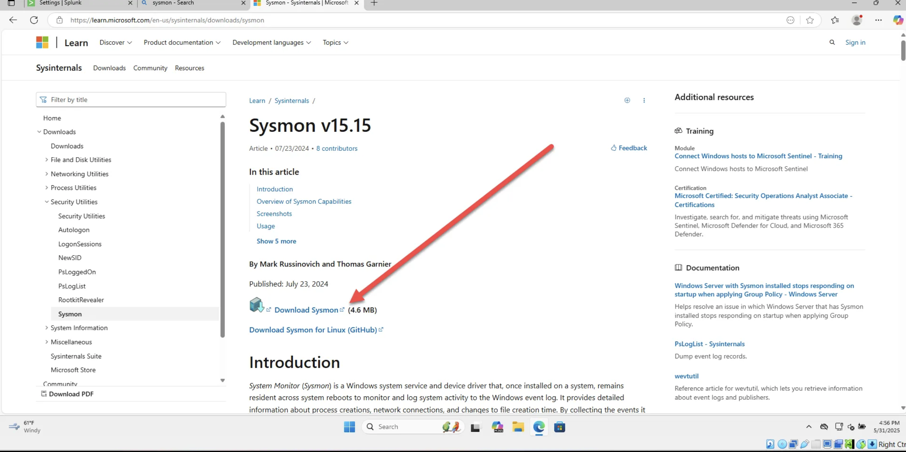
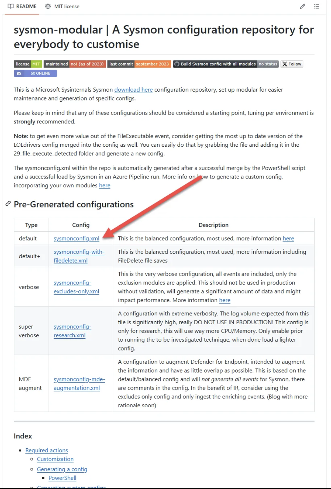
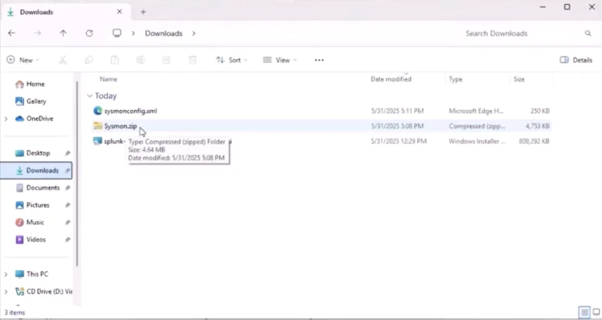
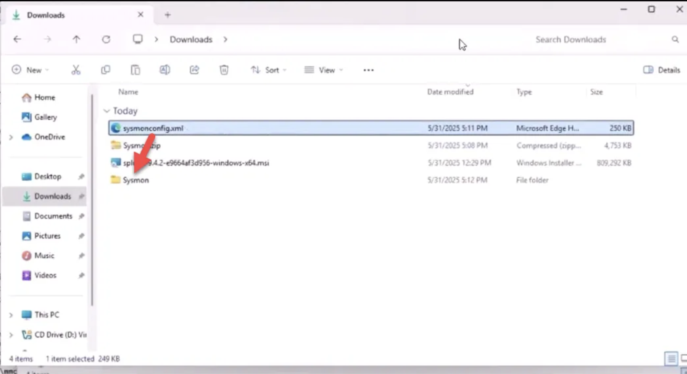
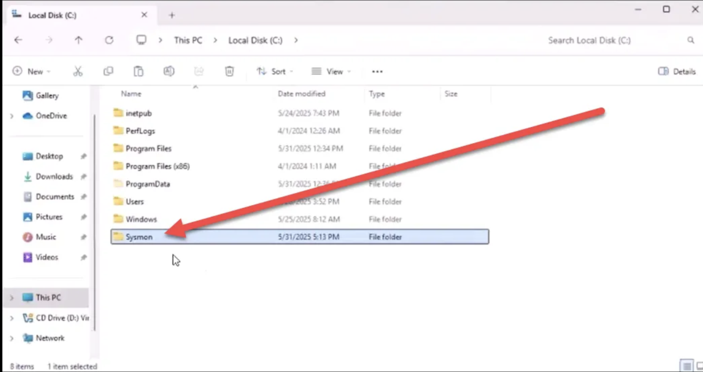
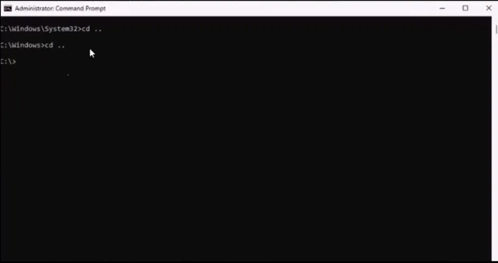
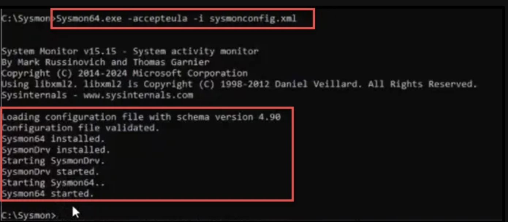
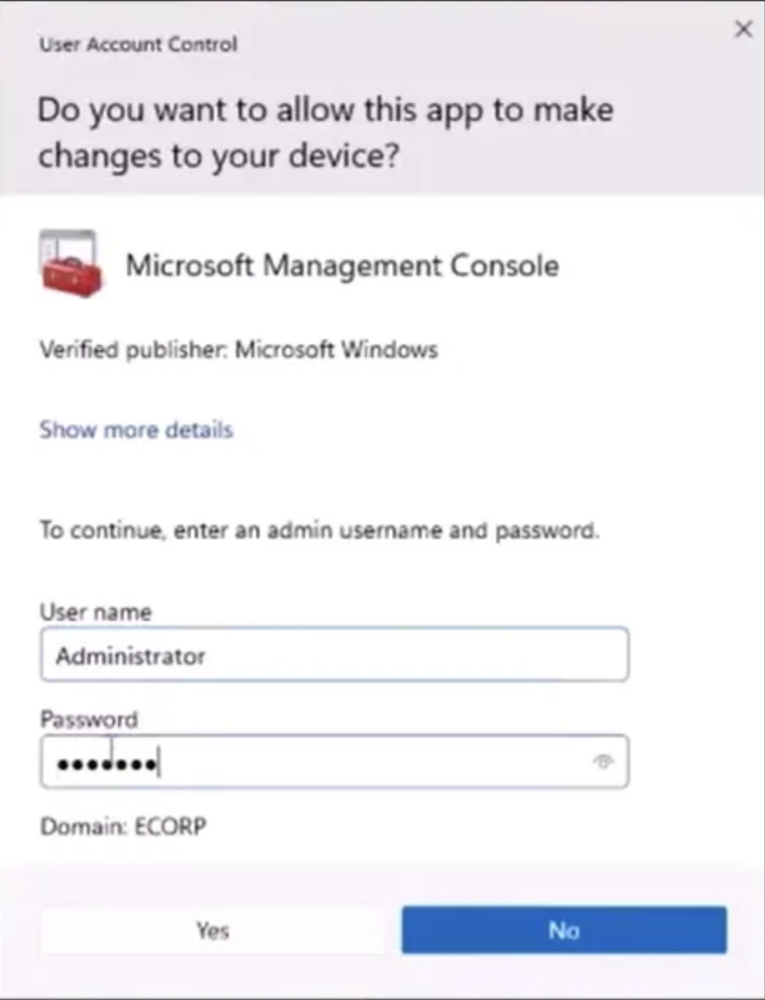
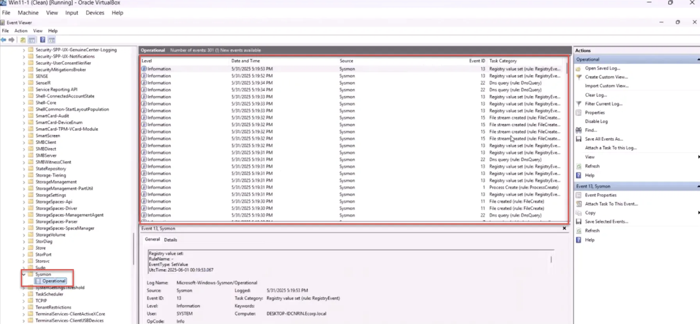

# 🖥️ Install Sysmon on Windows 11

## 📌 Sysmon Review

**System Monitor** (*Sysmon*) is a Windows system service and device driver that, once installed, stays resident across reboots to monitor and log system activity to the Windows Event Log.  
It provides detailed information about:

- Process creations
- Network connections
- Changes to file creation times

By collecting Sysmon events using [Windows Event Collection](https://msdn.microsoft.com/library/windows/desktop/bb427443(v=vs.85).aspx) or [SIEM](https://en.wikipedia.org/wiki/Security_information_and_event_management) tools, you can detect malicious or anomalous activity and understand attacker behavior.  
Sysmon runs as a [protected process](https://learn.microsoft.com/en-us/windows/win32/services/protecting-anti-malware-services-#system-protected-process), making it harder for attackers to tamper with.

### 🔹 Key Capabilities

- Logs process creation with **full command line** (current & parent process)
- Records hashes of process images (SHA1 default, MD5, SHA256, IMPHASH)
- Supports multiple hash algorithms simultaneously
- Includes **Process GUID** and **Session GUID** for event correlation
- Logs driver/DLL loads with signatures and hashes
- Logs raw disk/volume read access
- Optionally logs **network connections** with process, IP, port, and hostname
- Detects changes in file creation time (anti-tamper detection)
- Auto-reloads config if changed in the registry
- Rule filtering to dynamically include/exclude events
- Captures activity **early in the boot process** to catch kernel-mode malware

## 1️⃣ Download Sysmon

🔗 [Download Sysmon from Microsoft Sysinternals](https://learn.microsoft.com/en-us/sysinternals/downloads/sysmon)  

  

## 2️⃣ Download Sysmon Modular Configuration

Scroll down to **Pre-generated Configurations** in [SwiftOnSecurity’s Sysmon Config Repo](https://github.com/SwiftOnSecurity/sysmon-config) and download.  

  

## 3️⃣ Install Sysmon

1. **Unzip the Sysmon.zip** file.  
     

2. **Move the downloaded configuration file** to the unzipped Sysmon folder.  
     

3. **Move the Sysmon folder to `C:\`**.  
     

4. **Run Command Prompt as Administrator** and navigate to the Sysmon folder.  
     

5. **Install Sysmon** with the following command:  

   sysmon -accepteula -i config.xml

   

6. **Test Sysmon Installation**
   1. Open Event Viewer as Administrator
   2. Log in with Domain Admin credentials (if required)
   3. Navigate to:
   
   Applications and Service Logs → Microsoft → Windows → Sysmon → Operational

✅ If you see Sysmon events being logged, your installation was successful!

If you give me your **screenshot filenames**, I can replace `images/placeholder.png` with their actual paths so when you push to GitHub, everything will be linked and displayed correctly.  

Do you want me to now **replace placeholders with your actual screenshot names**? That way it’s 100% ready for push.
